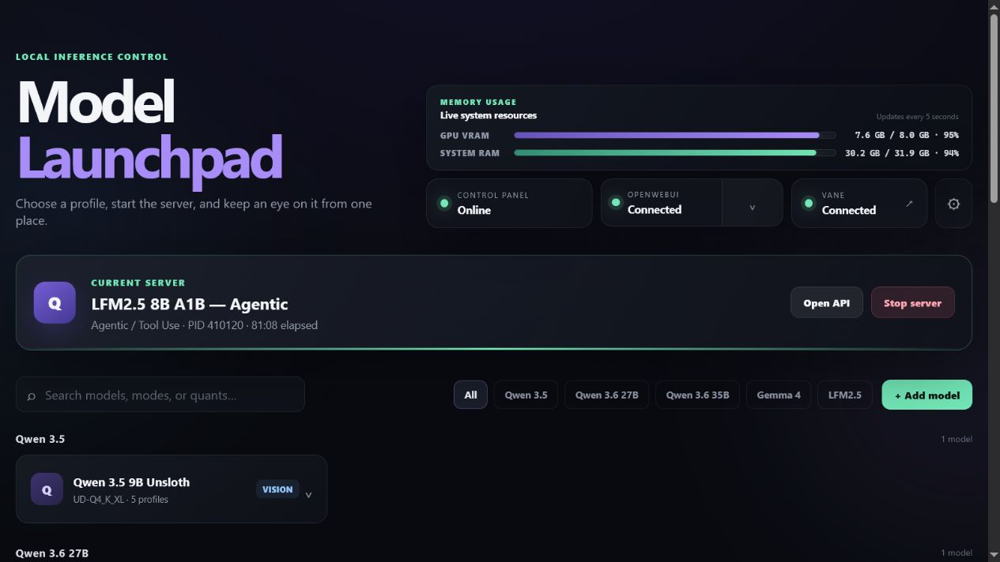
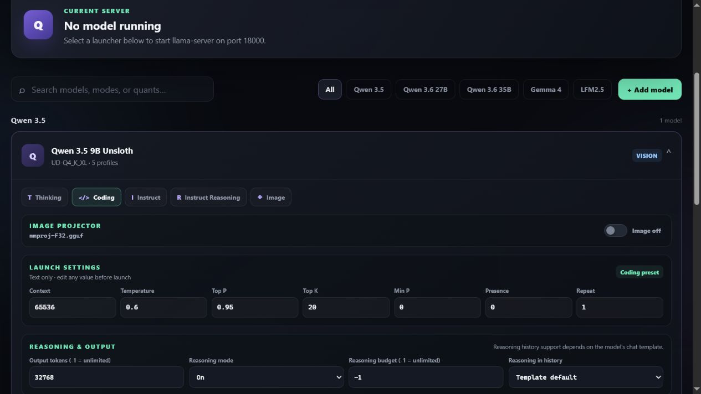

# Local Model Launchpad

[](https://github.com/MilitantTurtle/llama-launcher/actions/workflows/tests.yml)

A Windows-first web launchpad for running local GGUF models with `llama-server.exe`. It includes a source-linked model preset library, model/profile management, live status and logs, and a Windows tray menu.

Configuration, model paths, credentials, logs, and other runtime state stay local and are excluded from version control.

## Licence

Local Model Launchpad is available under the [PolyForm Noncommercial License 1.0.0](LICENSE) (`PolyForm-Noncommercial-1.0.0`). You may use it, fork it, change it, and redistribute it for non-commercial purposes. Commercial use is not permitted.

Because the licence restricts commercial use, this project is source-available rather than OSI-approved open-source software.

## Screenshots

### Running dashboard

Monitor memory use, connected local services, and the active llama-server process from one place.



### Model profiles and launch controls

Choose a task-specific preset, then review or edit its sampling, context, reasoning, and performance settings before launch.



## Quick start

Requirements:

- Windows 10 or 11
- Python 3.11 or newer on `PATH`
- A recent llama.cpp build containing `llama-server.exe`

Right-click `start-launchpad.ps1`, choose **Run with PowerShell**, and complete the first-run window. Choose the folder containing `llama-server.exe`; setup asks that binary for its available compute devices and lets you use automatic selection, a reported accelerator, or CPU-only mode. You can also enter an optional username and password for LAN access.

The first run creates `config.json` and an empty `models.json`. Both are deliberately ignored by Git. The browser interface is available at `http://127.0.0.1:8766/` on the host machine.

You can also configure it without the window:

```powershell
python setup.py --llama-server "C:\llama.cpp\build\bin" --device auto
```

Or copy `config.example.json` to `config.json` and edit it manually. The path must point to an existing `llama-server.exe`.

## LAN access and security

By default, both Launchpad and llama-server bind to `0.0.0.0`. Windows Firewall still controls whether another device can connect. Launchpad accepts loopback and RFC 1918 private addresses by default; edit `allowed_networks` to make that narrower.

The optional username/password gate uses HTTP Basic authentication with a salted scrypt hash in `config.json`; the password itself is not stored. Basic authentication over plain HTTP does **not** encrypt traffic or credentials. Treat it as a casual trusted-LAN gate. For untrusted networks, put the app behind HTTPS, a VPN, or an authenticated reverse proxy. Do not expose its ports directly to the internet.

To generate a replacement password hash:

```powershell
python setup.py --hash-password "your new password"
```

Place the printed value in `authentication.password_hash`, set a username, and set `authentication.enabled` to `true`.

## Configuration

- `config.json`: bind addresses, allowed networks, authentication, llama-server executable and launch defaults.
- `models.json`: generated local models and launch profiles. It starts empty and is ignored by Git so model paths remain local.
- `preset-library.json`: source-linked recommended profiles matched from model filenames.
- `settings.json`: optional OpenWebUI, OpenTerminal, and Vane integrations. These default off and are created only when settings are saved.

Set `OPENWEBUI_ROOT` if you want the optional local service controls to use an OpenWebUI installation outside the default sibling folder. Set `LAUNCHPAD_PYTHON` if `python.exe` is not on `PATH`.

`server.device` accepts `auto`, `none` for CPU-only, or a device identifier reported by `llama-server.exe --list-devices`, such as `CUDA0` or `Vulkan0`. Automatic mode omits the `--device` argument and lets llama.cpp select from the backends compiled into that binary.

## Duplicate-launch safety

Each installation owns a Windows named mutex derived from its absolute folder. Starting the same installation twice opens the existing interface and exits; it does not kill processes by executable name or by port. Separate copies in separate folders remain independent.

Launchpad only stops a model process created by the currently running Launchpad instance, after verifying its executable path. It never adopts an already-running or stale `llama-server.exe`. If a different process owns the configured model port, launching is refused without terminating that process. Optional OpenWebUI and OpenTerminal controls are start-only because ownership of processes created by their external scripts cannot be proven safely.

## Development checks

```powershell
python -m unittest discover -s tests -v
python app.py --check
```

`app.py --check` requires a valid local `config.json` and an existing `llama-server.exe`.

The same compile and test checks run on `windows-latest` for every GitHub push and pull request.
